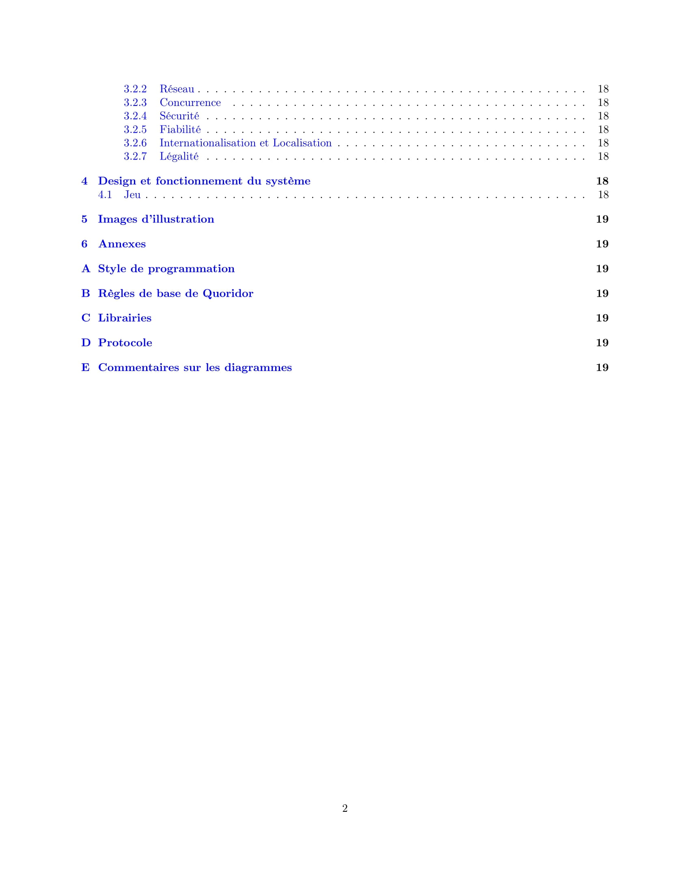
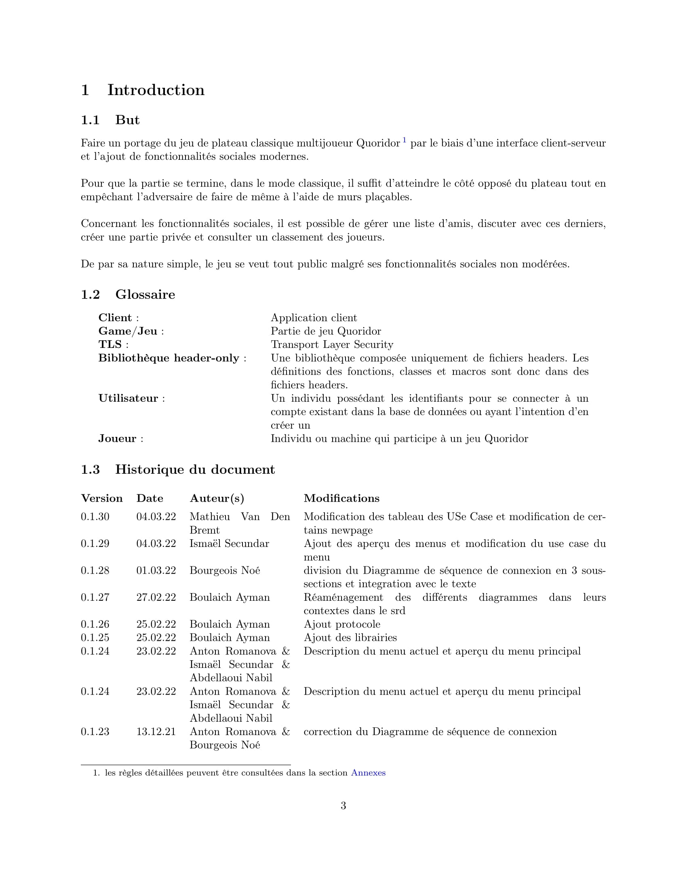
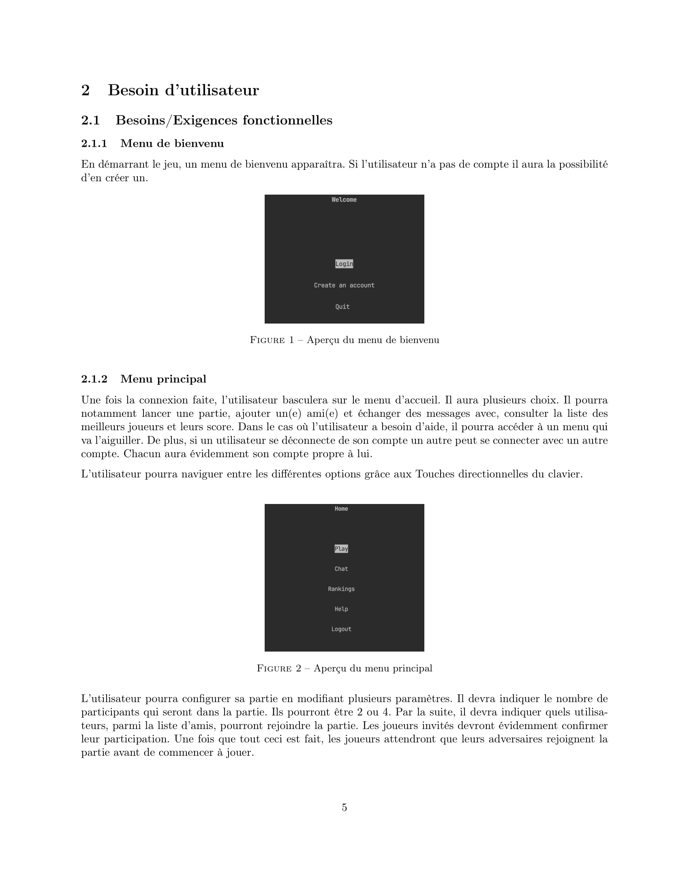
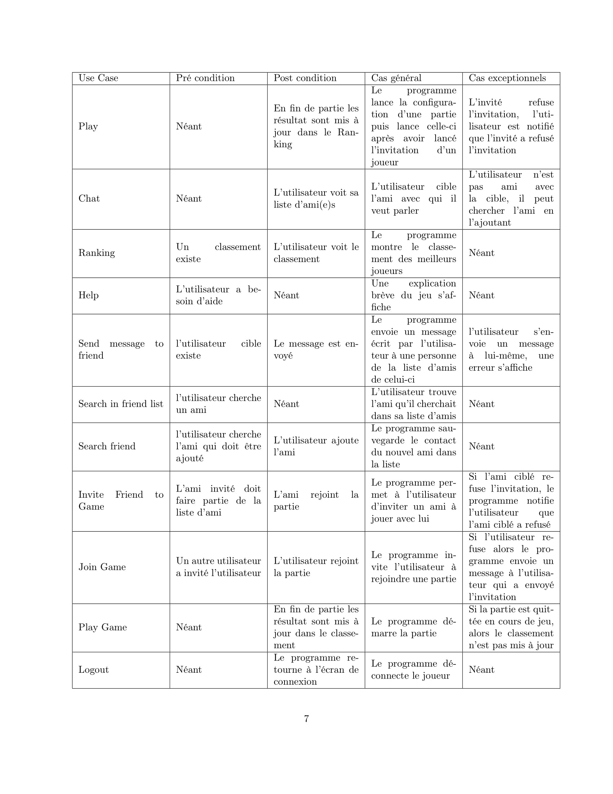
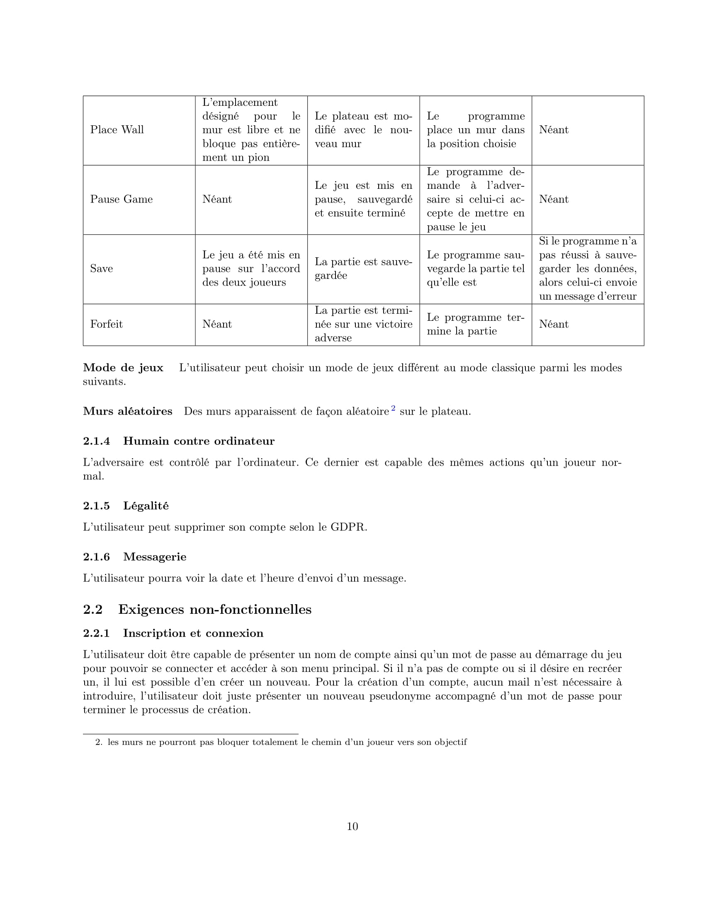
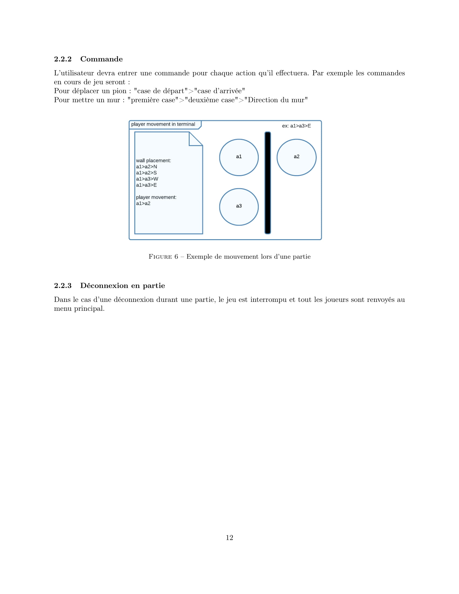
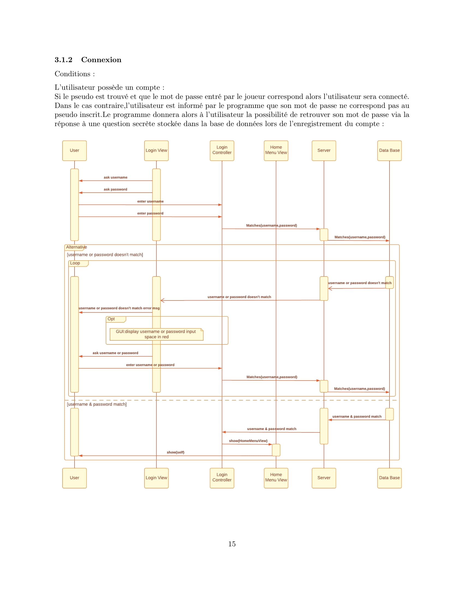
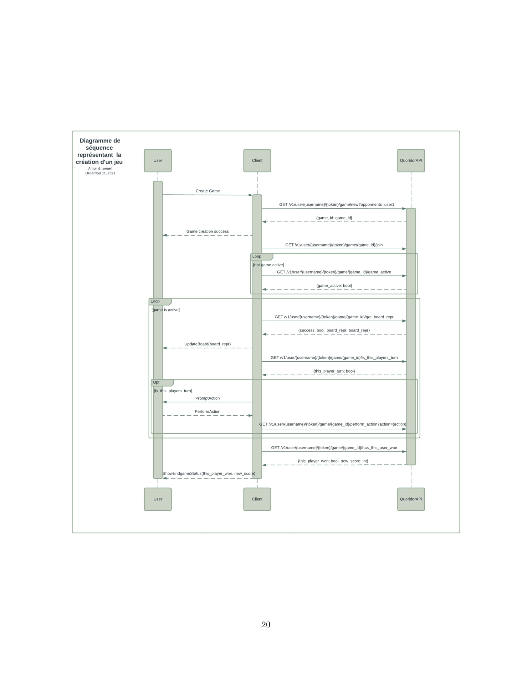
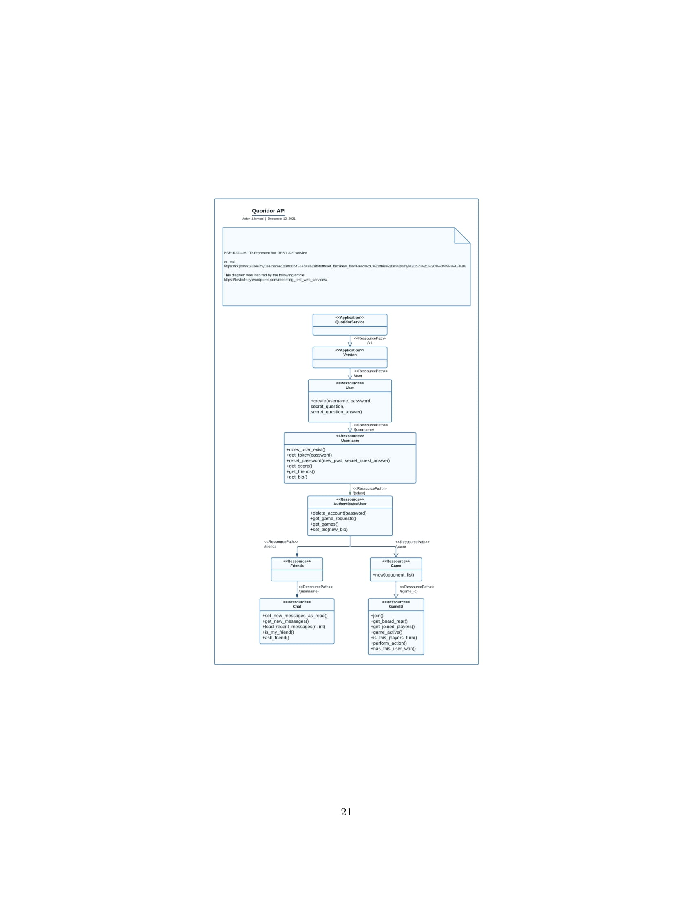

# INFO-F209
Making the classical board game Quoridor with the addition of social features such as managing a friend list and many others

## Required packages
The following packages must be downloaded for the project to work the intended way  

### sqlite3
A database library for C++

**Ubuntu**
```
$ sudo apt-get install sqlite3
$ sudo apt-get install libsqlite3-dev
```
> Download [link](https://www.sqlite.org/download.html) for manual download

### boost
An all-purpose networking library for C++

**Ubuntu**
```
& sudo apt-get install libboost-all-dev
```
> Download [link](https://www.boost.org/) for manual download

### OpenSSL

**Ubuntu**
```
& sudo apt-get install libssl-dev
```

**Windows**
>Download [link](https://slproweb.com/products/Win32OpenSSL.html) for manual download

### crow
A web service framework library for C++

**Ubuntu**  
Manual download only  
>Download [link](https://github.com/CrowCpp/Crow) for manual download

#### Dependencies
* openssl
* boost


### curl
command line tool and library for transferring data with URLs

**Ubuntu**  
```
$ sudo apt-get install curl
$ sudo apt-get install libcurl-dev
```

### ncurses
A simple text-based user interface library for C/C++

**Ubuntu**
```
$ sudo apt-get install libncurses5-dev libncursesw5-dev
```
### uuid
Unique identifier library  

**Ubuntu**
```
$ sudo apt-get install uuid uuid-dev
```
## Build
```
$ cmake -S . -B bin/
$ cd bin 
$ make
```

## Execution
```
$ ./QuoridorServer
$ ./QuoridorClient
```

orioniris
#9738

Anton Romanova — Aujourd’hui à 21:48
Oui mais ils ont authorise les libs
Nabil Abdellaoui — Aujourd’hui à 21:49
Faut juste le prévenir
Anton Romanova — Aujourd’hui à 21:49
Il a le super utilisateur, il peut installer boost et qt6 sans pb
Nabil Abdellaoui — Aujourd’hui à 21:50
Ça c'est autre chose encore je pense
Mais sacrifier le chat c'est chaud quand meme 
Et donc c'est quoi la finalité ? @everyone
Esteban Aguililla Klein — Aujourd’hui à 21:57
bon au pire j'ai fait un truc qui compile les deux éxecutalbe avec un cmake dans le root je push çà ?
çà donnerait cmake -S . -B build ; cd build; make; cd.. dans / 
et les exécutable sont dans /
pour serveur et client
Nabil Abdellaoui — Aujourd’hui à 21:59
Si y'a les 2 exé en root c'est cool en vrai mais faut que tt le monde réponde @everyone
Si dans 30 mins ça répond pas
Je mange mon chapeau
Anton Romanova — Aujourd’hui à 22:00
dans le root ou directement dans ./build
Esteban Aguililla Klein — Aujourd’hui à 22:00
le root
INFOFF/
Mathieu Van Den Bremt — Aujourd’hui à 22:01
jsp parce qu'il a dit qu'on puvait utiliser les lib mais en même temps il a bcp insisté que ça fonctionne au NO
mais on pourrait tenter de garder le chat mais faut absolument le prévenir alors
Noé Bourgeois — Aujourd’hui à 22:03
Au pire il a le Conan cmakelist si il préfère sudo ou pas de chat haha
Nabil Abdellaoui — Aujourd’hui à 22:07
Image
Anton Romanova — Aujourd’hui à 22:09
Aussi il a dit à un moment qu'on pouvait lui envoyer les binaires déjà compilés
Donc qqn qui  a dual boot (ou monoboot) sur linux peut compiler les binaries finaux et les envoyer
Et ça devrait marcher sur les machines
Guyz est-ce que qqn peut ajouter un label qui dit si c'est à nous ou pas pour le jeu?
Nabil Abdellaoui — Aujourd’hui à 22:14
@everyone  c'est giga important là on est tous perdu ça fait mal à la tête on peut aller en vocal ?
@Noé Bourgeois
Anton Romanova — Aujourd’hui à 22:22
Image
Nabil Abdellaoui — Aujourd’hui à 22:31
@Anton Romanova tu pourras envoyer ?
Vlad Moruntale — Aujourd’hui à 22:38
@Anton Romanova  le .sh est fait
Nabil Abdellaoui — Aujourd’hui à 22:38
je peux partir comme ça @Anton Romanova
Image
Anton Romanova — Aujourd’hui à 22:40
Oui pas mal!
Anton Romanova — Aujourd’hui à 22:40
Nice!
Anton Romanova — Aujourd’hui à 22:40
Envoyer?
Ah oui il faudrait aussi changer le chemin relatif des pixmals
maops
maps
Esteban Aguililla Klein — Aujourd’hui à 22:41
j'ai push un chemin adapté aux cmake actuels normalement çà devrait être bon
Anton Romanova — Aujourd’hui à 22:42
Ok nice
Nabil Abdellaoui — Aujourd’hui à 22:54
ça va @Anton Romanova
Image
Nabil Abdellaoui — Aujourd’hui à 23:01
Image
Image
Anton Romanova — Aujourd’hui à 23:08
Il y a des petites erreurs. Genre api/v1/me/add_friend c'est bon, maisapi/v1/me/add_friend/new n'existe pas
Mais j'ai pas tout regardé
Nabil Abdellaoui — Aujourd’hui à 23:08
CRAP
Anton Romanova — Aujourd’hui à 23:26
Image
J'ai fait un diagramme de la db
Pour celui qui fait le srd
Aussi j'ai ajouté les clés étrangères dans la db, du coup si vous voulez tester il faut supprimer l'ancienne exemple.db, je pense pas que ce soit compatible
Noé Bourgeois — Aujourd’hui à 23:32
\MyIncludeGraphicsMaxSize{
Anton Romanova — Aujourd’hui à 23:53
# API

## Requests

### **GET** - /api/v1/users

#### Description
Returns all users

#### CURL

```sh
curl -X GET "http://0.0.0.0:18080/api/v1/users"
```

### **GET** - /api/v1/users/ranking

#### Description
Returns a list of users sorted by score

#### CURL

```sh
curl -X GET "http://0.0.0.0:18080/api/v1/users/ranking\
?max_num_users=5" \
    -H "Content-Type: text/plain"
```

#### Query Parameters

- **max_num_users**

### **GET** - /api/v1/new_user

#### Description
Creates a new user

#### CURL

```sh
curl -X GET "http://0.0.0.0:18080/api/v1/new_user" \
-u "user":"password"
```

#### Security

- Basic Authentication
  - **username**
  - **password**

### **GET** - /api/v1/me

#### Description
Returns current user

#### CURL

```sh
curl -X GET "http://0.0.0.0:18080/api/v1/me" \
-u "user":"password"
```

#### Security

- Basic Authentication
  - **username**
  - **password**

### **GET** - /api/v1/me/messages/send

#### Description
Sends a message to the given user

#### CURL

```sh
curl -X GET "http://0.0.0.0:18080/api/v1/me/messages/send\
?user=other_user_username&content=Message_content" \
-u "user":"password"
```

#### Query Parameters

- **user**
- **content**

#### Security

- Basic Authentication
  - **username**
  - **password**

### **GET** - /api/v1/me/messages

#### Description
Returns a list of all the messages

#### CURL

```sh
... (192 lignes restantes)
Réduire
QuoridorAPI.paw.md
5 Ko

# API

## Requests

### **GET** - /api/v1/users

#### Description
Returns all users

#### CURL

```sh
curl -X GET "http://0.0.0.0:18080/api/v1/users"
```

### **GET** - /api/v1/users/ranking

#### Description
Returns a list of users sorted by score

#### CURL

```sh
curl -X GET "http://0.0.0.0:18080/api/v1/users/ranking\
?max_num_users=5" \
    -H "Content-Type: text/plain"
```

#### Query Parameters

- **max_num_users**

### **GET** - /api/v1/new_user

#### Description
Creates a new user

#### CURL

```sh
curl -X GET "http://0.0.0.0:18080/api/v1/new_user" \
-u "user":"password"
```

#### Security

- Basic Authentication
  - **username**
  - **password**

### **GET** - /api/v1/me

#### Description
Returns current user

#### CURL

```sh
curl -X GET "http://0.0.0.0:18080/api/v1/me" \
-u "user":"password"
```

#### Security

- Basic Authentication
  - **username**
  - **password**

### **GET** - /api/v1/me/messages/send

#### Description
Sends a message to the given user

#### CURL

```sh
curl -X GET "http://0.0.0.0:18080/api/v1/me/messages/send\
?user=other_user_username&content=Message_content" \
-u "user":"password"
```

#### Query Parameters

- **user**
- **content**

#### Security

- Basic Authentication
  - **username**
  - **password**

### **GET** - /api/v1/me/messages

#### Description
Returns a list of all the messages

#### CURL

```sh
curl -X GET "http://0.0.0.0:18080/api/v1/me/messages\
?user=other_user" \
-u "user":"password"
```

#### Query Parameters

- **user**

#### Security

- Basic Authentication
  - **username**
  - **password**

### **GET** - /api/v1/me/add_friend

#### Description
Adds the other person as friend

#### CURL

```sh
curl -X GET "http://0.0.0.0:18080/api/v1/me/add_friend\
?username=friend_username" \
-u "user":"password"
```

#### Query Parameters

- **username**

#### Security

- Basic Authentication
  - **username**
  - **password**

### **GET** - /api/v1/me/all-users-except-me

#### Description
Returns a list of all the users except yourself

#### CURL

```sh
curl -X GET "http://0.0.0.0:18080/api/v1/me/all-users-except-me" \
-u "anton":"12341234"
```

#### Security

- Basic Authentication
  - **username**
  - **password**

### **GET** - /api/v1/me/games

#### Description
Returns a list of all the games you are admin of or were invited into

#### CURL

```sh
curl -X GET "http://0.0.0.0:18080/api/v1/me/games" \
-u "anton":"12341234"
```

#### Security

- Basic Authentication
  - **username**
  - **password**

### **GET** - /api/v1/me/game/1

#### Description
Returns a json of a game in particular

#### CURL

```sh
curl -X GET "http://0.0.0.0:18080/api/v1/me/game/1" \
-u "anton":"12341234"
```

#### Path Parameters

- **RequestVariable**

#### Security

- Basic Authentication
  - **username**
  - **password**

### **GET** - /api/v1/me/game/1/repr

#### Description
Returns the string representation of the given game

#### CURL

```sh
curl -X GET "http://0.0.0.0:18080/api/v1/me/game/1/repr" \
-u "anton":"12341234"
```

#### Path Parameters

- **RequestVariable**

#### Security

- Basic Authentication
  - **username**
  - **password**

### **GET** - /api/v1/me/game/1/my_turn

#### Description
Returns whether it is your turn or not

#### CURL

```sh
curl -X GET "http://0.0.0.0:18080/api/v1/me/game/1/my_turn" \
-u "user":"password"
```

#### Path Parameters

- **RequestVariable**

#### Security

- Basic Authentication
  - **username**
  - **password**

### **GET** - /api/v1/me/game/1/move

#### Description
Perform move for given game (only if it is the turn of the user)

#### CURL

```sh
curl -X GET "http://0.0.0.0:18080/api/v1/me/game/1/move\
?move_value=M-%3EF" \
-u "user":"password"
```

#### Path Parameters

- **RequestVariable** 

#### Query Parameters

- **move_value** 

#### Security

- Basic Authentication
  - **username**
  - **password**

### **GET** - /api/v1/me/games/new

#### CURL

```sh
curl -X GET "http://0.0.0.0:18080/api/v1/me/games/new\
?participants=$participants" \
    -H "Content-Type: text/plain" \
    --data-raw "$body" \
-u "user":"password"
```

#### Query Parameters

- **participants** 
- 
#### Security

- Basic Authentication
  - **username**
  - **password**

## References

QuoridorAPI.paw.md
5 Ko

## SRD






















